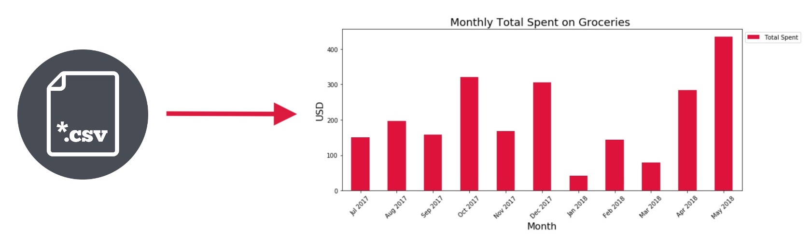

## TransFormer: Transaction Formatter

**Purpose:** To make managing personal finances actually personal. It should be super simple, without needing to worry about your bank or credit card info getting stolen by very probable cyber attacks (on Mint, for example).

**Details:** Right now it's meant to leave you with a basic CSV file that includes all the basic data you would need to plot financial data. It takes data from Chase or CapitalOne transaction CSV downloads, and loads it into a usable CSV. To use with *Matplotlib* or anything you may use to plot data from a CSV. This assumes you can plot using Python or another language.

**Checklist:**

* :ballot_box_with_check: Chase CSV support
* :ballot_box_with_check: CapitalOne CSV support
* :ballot_box_with_check: Converts to specified CSV format: **[Date, Amount, Description, Category]**
* :ballot_box_with_check: Adds positive float number for purchases, negative float numbers for refunds

**To Do:**

* Integrate banks API for easy CSV transaction access
* Create a new CSV for every import, and only grab the new data